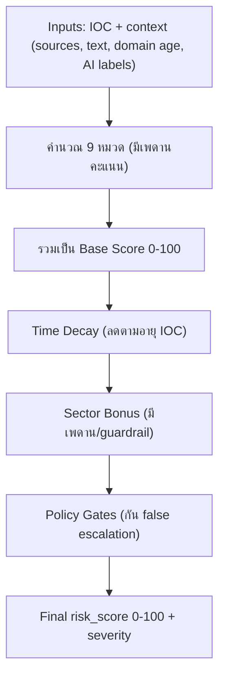

# AI Scoring System Documentation

> **Last Updated:** 2026-02-08  
> **Source of Truth:** `/Users/mm/Desktop/Cyber/ai-service/models/scorer.py`, `/Users/mm/Desktop/Cyber/ai-service/config.py`

## ภาพรวม

ระบบให้คะแนนความเสี่ยง IOC ใช้แนวทาง **Weighted Scoring (0-100)** พร้อม governance และ policy gates:

1. คำนวณคะแนนดิบรายปัจจัย (raw score)
2. แปลงเป็นคะแนนถ่วงน้ำหนักตาม `SCORING_WEIGHTS`
3. รวมเป็น `weighted_total` (0-100)
4. ใช้ `decay_factor` ลดคะแนนตามอายุ IOC
5. บวก `sector_bonus` (มี guardrail)
6. ใช้ policy gates เพื่อลด false escalation

ผลลัพธ์หลัก:
- `risk_score` / `operational_risk_score`
- `credibility_score`
- `impact_score`
- `score_model_version`
- `score_config_version`

---

## One-Pager (สำหรับอธิบายลูกค้า)

เป้าหมาย: ทำให้ทุกคนในห้องประชุมเข้าใจว่า “คะแนน 0-100 มาจากอะไร” ภายใน 2 นาที

### แนวคิดหลัก (พูดประโยคเดียว)
เราแบ่ง “คะแนนเต็ม 100” ออกเป็น **9 หมวด** (แต่ละหมวดมีเพดานคะแนนชัดเจน) แล้วค่อยปรับตาม “ความใหม่ของ IOC”, “ความเสี่ยงตามเซกเตอร์”, และ “กฎกัน false escalation”

### Flow (ภาพรวมการไหลของคะแนน)


### 9 หมวดของคะแนนเต็ม 100 (มองแบบ “งบคะแนน”)

หมายเหตุ: ในโค้ดใช้ `SCORING_WEIGHTS` เพื่อกำหนด “คะแนนเต็มต่อหมวด” ให้รวมกันได้ 100 แบบคุมสเกลได้แน่นอน

| หมวดคะแนน | คะแนนเต็ม (สูงสุด) | อะไรทำให้ได้คะแนนมากขึ้น | สรุปให้ลูกค้าแบบสั้น |
|---|---:|---|---|
| Cross-Source Validation | 25 | พบในหลายแหล่ง และหลากหลายประเภทแหล่ง | “มีคนอื่นยืนยันเหมือนกันไหม” |
| Source Quality | 15 | มี trusted threat intel (เช่น VT/ThreatFox) มากกว่าข่าว | “แหล่งน่าเชื่อถือแค่ไหน” |
| Threat Type Severity (AI) | 15 | ประเภทภัยหนัก (เช่น Ransomware/APT/C2) | “ถ้าจริง จะหนักแค่ไหน” |
| Threat Actor (AI) | 10 | พบชื่อกลุ่มที่ known | “โยงกับกลุ่มที่มีประวัติไหม” |
| Domain Age | 10 | โดเมนใหม่มาก | “infra ใหม่ผิดปกติไหม” |
| High-Risk Keywords | 10 | มี keyword เสี่ยงในข้อความ | “มีคำบ่งชี้ภัยไหม” |
| AI Confidence | 5 | โมเดลมั่นใจสูง | “AI มั่นใจแค่ไหน” |
| Entropy / DGA heuristic | 5 | ชื่อโดเมนสุ่มผิดปกติ | “โดเมนดูถูกสร้างอัตโนมัติไหม” |
| MITRE ATT&CK (AI) | 5 | พบ TTP/Technique มากขึ้น (cap) | “ความซับซ้อนของวิธีโจมตี” |
| **รวม Base Score** | **100** |  |  |

### Modifiers ที่ทำให้ “คะแนนใช้งานจริง” สมเหตุสมผล
| ส่วนปรับคะแนน | ทำอะไร | กติกาแบบสั้น |
|---|---|---|
| Time Decay | ลดคะแนน IOC เก่า | <=7 วัน 1.00, 8-30 วัน 0.90, 31-90 วัน 0.75, 91-180 วัน 0.60, >180 วัน 0.50 |
| Sector Bonus | เพิ่มตามผลกระทบของเซกเตอร์เป้าหมาย | มี guardrail: ถ้า confidence < 0.45 cap bonus <= 5 และถ้า news-only cap bonus <= 3 |
| Policy Gates | กัน false escalation | Critical gate: (score >= 80 และ trusted < 2) cap 74, News-only gate: (news-only และ score >= 50) cap 49 |

### Severity (แปลคะแนนเป็นระดับ)
| Final score | Severity |
|---:|---|
| >= 75 | critical |
| 50-74 | high |
| 25-49 | medium |
| 1-24 | low |
| 0 | clean |

### Q&A ที่มักโดนถาม (สั้นและตรง)
- ทำไมต้องมี WEIGHTS: เพราะแต่ละสัญญาณ “หน่วยไม่เท่ากัน” (บางอัน max 40 บางอัน max 15) จึงต้องแปลงให้อยู่บนสเกลเดียว 0-100 และกำหนดเพดานคะแนนต่อหมวดให้ชัดเจน (เท่ากับ “งบคะแนน”)
- ทำไม `cross_source = 0.25` (เพดาน 25 คะแนน): เพราะการ corroborate ข้ามแหล่งเป็นหลักฐานที่ลด false positive ได้ดีที่สุด จึงให้เป็นหมวดที่มีเพดานสูงสุดในกลุ่ม credibility
- ทำไม Cross-Source Validation ในเอกสารเทคนิคเป็น (max 30): นี่คือ “สเกลดิบภายใน” เพื่อทำ diminishing returns + diversity bonus ได้ละเอียด แล้วจึง map ไปเป็นเพดาน 25 คะแนนในสเกล 0-100

---

## สูตรการคำนวณ

```text
weighted_points(factor) = (factor_score_0_100 / 100) * weight * 100
weighted_total = Σ weighted_points(ทุก factor ที่เปิดใช้)

score_after_decay = round(weighted_total) * decay_multiplier
operational_risk = score_after_decay + sector_bonus (capped + policy-gated)
```

หมายเหตุ:
- `geo_risk` ถูกปิดใช้งาน (score = 0)
- มี policy gate ลดคะแนนกรณี evidence ไม่พอ (เช่น news-only)

---

## น้ำหนักที่ใช้จริง (`SCORING_WEIGHTS`)

น้ำหนัก (weight) คือ “สัดส่วนของคะแนนเต็ม 100” ดังนั้น **คะแนนเต็มของหมวด = weight × 100**

| Factor key | Weight | Max points (weight×100) |
|---|---:|---:|
| `cross_source` | 0.25 | 25 |
| `threat_intel_source` | 0.15 | 15 |
| `high_risk_keywords` | 0.10 | 10 |
| `domain_age` | 0.10 | 10 |
| `entropy` | 0.05 | 5 |
| `threat_type_severity` | 0.15 | 15 |
| `threat_actor` | 0.10 | 10 |
| `mitre_techniques` | 0.05 | 5 |
| `ai_confidence` | 0.05 | 5 |

---

## ปัจจัยการให้คะแนน (Factor Score)

ตั้งแต่เวอร์ชันปัจจุบัน ระบบจะ **normalize คะแนนของแต่ละปัจจัยให้อยู่ในสเกล 0-100** เพื่อให้ UI/การอธิบายเข้าใจง่ายขึ้น
- `score` = คะแนนของปัจจัยในสเกล 0-100 (normalize แล้ว)
- `raw_score` / `raw_max` = คะแนนดิบตามกติกาภายในเดิม (เพื่อ audit และ debug)

### 1) Cross-Source Validation (score max 100)
- 1 แหล่ง ≈ 16.67
- 2 แหล่ง ≈ 33.33
- 3 แหล่ง = 50.00
- 4+ แหล่ง = 66.67..93.33 (diminishing returns)
- มี bonus ตามความหลากหลายของประเภทแหล่ง (`trusted/news/other`) และ cap ไม่เกิน 100

> อ้างอิงกติกาดิบ (สำหรับ audit): ระบบคำนวณ raw score แบบเดิม (cap 30) แล้วค่อย normalize เป็น 0-100  
> ตัวอย่าง: raw=15/30 ⇒ score=50.00, raw=30/30 ⇒ score=100.00

> ทำไม raw max = 30 แต่หมวดนี้มี 2 ตัวเลข (100 และ 25)?
> - `raw_max=30` คือสเกลดิบภายในของกติกา cross-source
> - `score max 100` คือคะแนนของปัจจัย (normalize) ที่ใช้แสดงผล: `score = (raw/30) * 100`
> - แต่ “คะแนนที่นำไปรวมจริง” (budget ตาม weight 0.25) มีเพดาน 25 คะแนน: `points = (raw/30) * 25`
> - ตัวอย่าง: raw=15 → score=50.00 แต่ points=12.5

### 2) Source Quality (score max 100)
- Trusted source (raw +15) ⇒ +37.50
- News source (raw +8) ⇒ +20.00
- Other source (raw +5) ⇒ +12.50
- cap ไม่เกิน 100 (raw cap 40)

> อ้างอิงกติกาดิบ (สำหรับ audit): score_raw = trusted*15 + news*8 + other*5 (cap 40) แล้ว normalize เป็น 0-100 ด้วย (raw/40)*100

### 3) High-Risk Keywords (score max 100)
- 1 keyword ⇒ 20
- 2 keywords ⇒ 40
- 3 keywords ⇒ 60
- 4 keywords ⇒ 80
- 5+ keywords ⇒ 100
- ใช้ regex boundary-aware เพื่อลด false positive จาก substring

### 4) Entropy (score max 100)
ใช้กับ domain/url/hostname
- Entropy > 4.0 ⇒ 100
- Entropy > 3.5 ⇒ 66.67
- Entropy > 3.0 ⇒ 33.33
- อื่นๆ ⇒ 0

### 5) Domain Age (score max 100)
ใช้กับ domain/url/hostname
- < 30 วัน ⇒ 100
- < 90 วัน ⇒ 75
- < 180 วัน ⇒ 50
- < 365 วัน ⇒ 25
- >= 365 วัน ⇒ 0

### 6) Threat Type Severity (AI) (score max 100)
- อิงจาก `THREAT_TYPE_SEVERITY`
- นับสูงสุด 2 threat types
- มี multi-threat bonus เมื่อพบ >=3 types

> อ้างอิงกติกาดิบ (สำหรับ audit): factor_score = (raw_score/35)*100 (cap 100)

### 7) Threat Actor Attribution (AI) (score max 100)
- แมป actor กับ `KNOWN_THREAT_ACTORS`
- เลือก score สูงสุดของ actor ที่พบ

> อ้างอิงกติกาดิบ (สำหรับ audit): factor_score = (raw_score/30)*100 (cap 100)

### 8) MITRE ATT&CK (AI) (score max 100)
- คิดคะแนนจาก tactic/ID ที่พบ
- extractor รองรับทั้งรูปแบบ `Txxxx(.xxx)` และ tactic names ที่อยู่ใน config

> อ้างอิงกติกาดิบ (สำหรับ audit): factor_score = (raw_score/20)*100 (cap 100)

### 9) AI Confidence Bonus (score max 100)
Threshold จาก `CONFIDENCE_THRESHOLDS`:
- `>= 0.93` => 80
- `>= 0.85` => 50
- `>= 0.70` => 20
- ต่ำกว่า => 0

### 10) Geo Risk
- ปิดใช้งาน (`score = 0`)

---

## Decay Factor

ลดคะแนนตามอายุ IOC (`ioc_age_days`):

| อายุ IOC | Multiplier |
|---|---:|
| <= 7 วัน | 1.00 |
| 8-30 วัน | 0.90 |
| 31-90 วัน | 0.75 |
| 91-180 วัน | 0.60 |
| > 180 วัน | 0.50 |

---

## Sector Bonus และ Guardrails

- คำนวณ sector จาก classifier แล้วบวก `risk_bonus` ตาม `SECTOR_RISK_BONUS`
- มี guardrail:
  - หาก confidence sector ต่ำ (`< 0.45`) จำกัด bonus สูงสุด 5
  - หากเป็นข่าวล้วน (news-only) จำกัด bonus สูงสุด 3

---

## Policy Gates (ลด False Escalation)

1. **Critical escalation gate (trusted corroboration)**
- ถ้าคะแนนหลัง decay + sector bonus **>= 80** แต่ `trusted` corroboration **< 2** แหล่ง
- cap เป็น **74 (High)** เพื่อกัน false critical จาก evidence ที่ยังไม่แข็งแรง

2. **News-only gate**
- ถ้าเป็นข่าวล้วน (news-only: `trusted==0 && news>0 && other==0`) และคะแนน **>= 50**
- cap เป็น **49 (Medium)** จนกว่าจะมี non-news corroboration

policy ที่ trigger จะบันทึกใน `breakdown.policy_gate` (เช่น `triggered`, `adjustments`)

---

## Severity Mapping

| คะแนน | Severity |
|---|---|
| >= 75 | critical |
| 50-74 | high |
| 25-49 | medium |
| 1-24 | low |
| 0 | clean |

---

## Threat Type Severity (สรุป)

| Level | ประเภทภัย | คะแนน |
|---|---|---:|
| 🔴 Critical | Ransomware, APT, C2, Wiper, Botnet | 22-25 |
| 🟠 High | Malware, Credential Theft, Backdoor, Exploit, Trojan, Data Breach | 15-18 |
| 🟡 Medium | Phishing, DDoS, Spam, Scanning | 6-12 |
| 🟢 Low | Vulnerability, Defacement, Other | 3-8 |

> รายละเอียดเต็มอยู่ใน `config.py` → `THREAT_TYPE_SEVERITY`

---

## Output ที่สำคัญ

- `risk_score`: คะแนนสุดท้าย 0-100
- `operational_risk_score`: alias ของคะแนนสุดท้าย
- `credibility_score`: สัดส่วนด้านความน่าเชื่อถือของ evidence
- `impact_score`: สัดส่วนด้านผลกระทบ
- `breakdown`: รายปัจจัย + weighted score + governance + policy gates
- `top_factors`: ปัจจัยที่ contribute สูงสุด
- `target_sector`: ผล sector classification เต็มรูปแบบ
- `score_model_version`, `score_config_version`: สำหรับ audit / change control

---

## ตัวอย่างการคำนวณ

**IOC:** `malware-c2.evil-domain[.]net`  
**แหล่งที่พบ:** VirusTotal, ThreatFox, BleepingComputer (3 แหล่ง)  
**ประเภท:** C2, Malware  
**Threat Actor:** Lazarus  
**Keywords:** c2, backdoor  
**Domain Age:** 15 วัน  
**IOC Age:** 3 วัน  

> หมายเหตุ: ตารางตัวอย่างด้านล่างแสดง **raw score ภายใน (raw_score/raw_max)** เพื่อให้เห็นที่มาของแต้มตามกติกาเดิม  
> ใน output จริง `breakdown.<factor>.score` จะถูก normalize เป็น 0-100 แล้ว (และยังเก็บ raw_score/raw_max ไว้เพื่อ audit)

```text
Factor              Raw Score    Max    Weight    Weighted Points
─────────────────────────────────────────────────────────────────
Cross-Source        15           30     0.25      12.5
Source Quality      38           40     0.15      14.25
Keywords            10           25     0.10      4.0
Domain Age          20           20     0.10      10.0
Entropy             10           15     0.05      3.33
Threat Type         43 (cap 35)  35     0.15      15.0
Threat Actor        30           30     0.10      10.0
MITRE               8            20     0.05      2.0
AI Confidence       8            10     0.05      4.0
─────────────────────────────────────────────────────────────────
                               weighted_total = 75.08 → round = 75

Decay Factor:       1.00 (IOC age 3 วัน)
Sector Bonus:       +10 (financial sector, high confidence)
─────────────────────────────────────────────────────────────────
Final Score:        85 → Critical

Policy Gate Check:
- trusted sources = 2 (VirusTotal, ThreatFox) ✓ ≥ 2 required
- non-news corroboration = yes ✓
→ No cap applied, severity = Critical
```

### ตัวอย่าง 2: News-Only Evidence (Policy Gate Triggered)

**IOC:** `suspicious-phish[.]com`  
**แหล่งที่พบ:** BleepingComputer, DarkReading (2 แหล่ง — ทั้งหมดเป็น news)  
**ประเภท:** Phishing  
**Keywords:** phishing  
**Domain Age:** 45 วัน  

```text
Factor              Raw Score    Max    Weight    Weighted Points
─────────────────────────────────────────────────────────────────
Cross-Source        10           30     0.25      8.33
Source Quality      16           40     0.15      6.0
Keywords            5            25     0.10      2.0
Domain Age          15           20     0.10      7.5
Entropy             5            15     0.05      1.67
Threat Type         12           35     0.15      5.14
Threat Actor        0            30     0.10      0.0
MITRE               0            20     0.05      0.0
AI Confidence       5            10     0.05      2.5
─────────────────────────────────────────────────────────────────
                               weighted_total = 33.14 → round = 33

Decay Factor:       1.00 (IOC age 2 วัน)
Sector Bonus:       +3 (general sector, news-only capped)
─────────────────────────────────────────────────────────────────
Raw Score:          36 → Medium

Policy Gate Check:
- trusted sources = 0 ⚠️ (news-only)
- non-news corroboration = no ⚠️
→ ❌ Policy gate triggered: cap below High until trusted corroboration

breakdown.policy_gate: "news_only_cap"
```

> **หมายเหตุ:** แม้คะแนนจะสูงพอเป็น Medium แต่หากต้องการขึ้น High/Critical จะต้องมี trusted source อย่างน้อย 1 แหล่ง

---

## หมายเหตุ Governance

- ค่าใน `SCORING_WEIGHTS` ถูกใช้จริงในการคำนวณ
- ทุก score ต้อง trace ได้จาก breakdown และ source evidence
- ควรทำ calibration ต่อเนื่องกับ incident จริง (false positive / false negative review)
