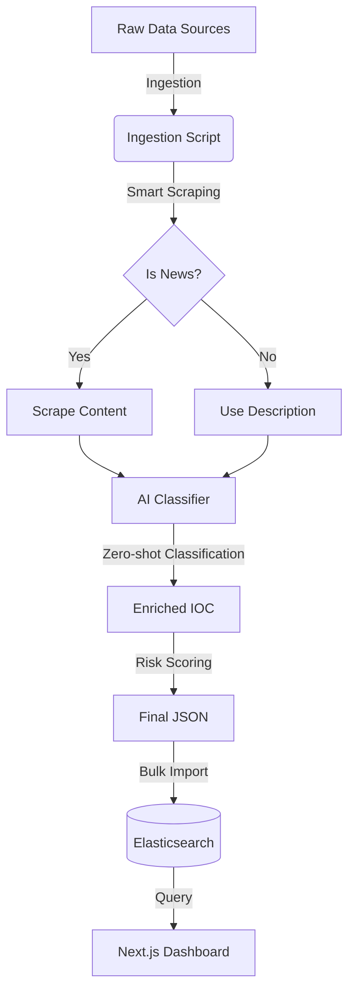

# 🧠 AI Threat Intelligence Pipeline Explained (ฉบับภาษาไทย)

เอกสารนี้อธิบายกระบวนการทำงานของ **AI Service** ตั้งแต่ต้นน้ำ (Ingestion) จนถึงปลายน้ำ (Visualization) อย่างละเอียด เพื่อให้ทีม Developer เข้าใจโครงสร้างและอัลกอริทึมที่เราใช้

---

## 🏗️ ภาพรวมระบบ (Architecture Overview)



---

## 1. 📥 Ingestion (การนำเข้าข้อมูล)

**ไฟล์หลัก:** `ai-service/scripts/ingest.py`

เราไม่ได้แค่ดึงข้อมูลมาเก็บ แต่เราทำ **"Smart Harvesting" & "Incremental Update"**

### 🔍 1.1 กระบวนการทำงาน (Process Flow)
1.  **Scan:** อ่านไฟล์ JSON ทั้งหมดใน `data_lake/`
2.  **Deduplication:** ตรวจสอบกับ Cache (`existing_iocs`) ว่าเคยประมวลผลไปแล้วหรือยัง
    *   *Logic:* ถ้า `description` เดิมยาวพอ (>20 chars) และเคย Scrape แล้ว -> **ข้าม (Skip)** เพื่อความเร็ว
3.  **Batch Processing:** ส่งข้อมูลให้ AI ทีละกลุ่ม (Batch) เพื่อลด Overhead ของ CPU

### 🤖 1.2 Smart Scraping Logic
เราเขียน Logic เพื่อตัดสินใจว่าจะ Scrape หรือไม่ (เพื่อประหยัดเวลา):
```python
SCRAPABLE_SOURCES = ["BleepingComputer", "TheHackerNews", "DarkReading"]

if source in SCRAPABLE_SOURCES and not is_scraped:
    # 🐢 ยอมเสียเวลาโหลดหน้าเว็บ (3-5 วินาที/เว็บ)
    # ใช้ requests + BeautifulSoup4
    content = scraper.scrape(url) 
else:
    # 🐇 ข้ามเลย ใช้ Description เดิม (0.001 วินาที)
    content = original_description
```
* **ผลลัพธ์:** การรันครั้งแรก (First Run) อาจใช้เวลา 2-3 ชม. แต่ครั้งต่อไป (Incremental) จะใช้เวลาแค่ไม่กี่นาที

---

## 2. 🧠 AI Analysis (สมองของระบบ)

**ไฟล์หลัก:** `ai-service/models/classifier.py`

นี่คือหัวใจสำคัญที่เราเสียเวลาประมวลผลนานๆ เพื่อแลกกับ Intelligence

### 🏷️ 2.1 Zero-Shot Classification
เราใช้โมเดล **`facebook/bart-large-mnli`** 
*   **ทำไมต้อง Zero-shot?** เพราะเราไม่ต้องเทรนโมเดลเอง เราแค่โยน "ป้ายกำกับ" (Labels) ให้มันเลย เช่น `["Ransomware", "Phishing", "Data Breach", "Vulnerability"]`
*   **การทำงาน:** โมเดลจะอ่านเนื้อหาข่าว 1,000 คำ แล้วตอบกลับมาว่า "เนื้อหานี้ตรงกับป้าย Ransomware 98.5%"

### 📊 2.2 Risk Scoring Formula (สูตรคำนวณความเสี่ยง)

**ไฟล์:** `ai-service/models/scorer.py` (941 บรรทัด)

คะแนน **100 คะแนนเต็ม** คำนวณจาก **11 ปัจจัย** ดังนี้:

#### ปัจจัยแบบ Traditional (ไม่ต้องใช้ AI)

| ปัจจัย | คะแนนเต็ม | ความหมาย |
|--------|:---:|-----------|
| **Cross-Source Validation** | 40 | พบใน 2+ แหล่ง = น่าเชื่อถือ (1แหล่ง=5, 2แหล่ง=15, 3แหล่ง=25, 4+=40) |
| **Source Quality** | 40 | แหล่งเชื่อถือ (VirusTotal)=15, ข่าว=8, อื่นๆ=5 ต่อแหล่ง |
| **Keywords** | 25 | พบคำอันตราย (ransomware, APT, zero-day) คำละ 5 คะแนน |
| **Entropy (DGA)** | 15 | วิเคราะห์ความสุ่มของชื่อโดเมน (สูง=สุ่มมาก=อาจเป็น DGA) |
| **Domain Age** | 20 | โดเมนใหม่ <30 วัน=20, <90 วัน=15, <180 วัน=10, <365 วัน=5 |
| ~~**Geo Risk**~~ | ~~15~~ | **(ปิดใช้งาน)** ไม่มีแหล่งข้อมูลที่ตรวจสอบได้ |

#### ปัจจัย AI-Powered (ใช้ BART Model)

| ปัจจัย | คะแนนเต็ม | ความหมาย |
|--------|:---:|-----------|
| **Threat Type Severity** | 35 | ประเภทภัยจาก AI (Ransomware/APT=15, Botnet=12, Phishing/Malware=10) |
| **Threat Actor** | 30 | พบชื่อกลุ่มแฮกเกอร์ที่รู้จัก (Lazarus, APT28 = 25 คะแนน) |
| **MITRE ATT&CK Tactics** | 20 | พบกี่ tactic (5+ tactics = 20 คะแนน = Advanced) |
| **AI Confidence Bonus** | 10 | AI มั่นใจ ≥90%=10, ≥80%=8, ≥70%=5, ≥60%=3 |

#### ตัวปรับคะแนน (Modifier)

| ปัจจัย | ค่าคูณ | ความหมาย |
|--------|:---:|-----------|
| **Decay Factor** | ×0.5-1.0 | IOC เก่า = ลดคะแนน (≤7 วัน=100%, 8-30 วัน=90%, 31-90 วัน=75%, 91-180 วัน=60%, >180 วัน=50%) |

#### สูตรรวม
```
คะแนนดิบ = Σ(ปัจจัยทั้ง 10 ข้อ)  // สูงสุด ~250 คะแนน
คะแนน Normalize = min(100, 70 + (คะแนนดิบ - 100) × 0.3)  // ถ้าเกิน 100
คะแนนสุดท้าย = คะแนน Normalize × Decay Factor
```

#### ระดับความรุนแรง (Severity)
- **Critical:** ≥ 75 คะแนน 🔴
- **High:** 50-74 คะแนน 🟠
- **Medium:** 25-49 คะแนน 🟡
- **Low:** 1-24 คะแนน 🟢
- **Clean:** 0 คะแนน ⚪


---

## 3. 🔮 Trend Prediction (การพยากรณ์อนาคต)

**ไฟล์หลัก:** `ai-service/models/trend_predictor.py`

เราใช้ Library **`Prophet`** (ของ Facebook) เพื่อทำ Time-series Forecasting

*   **Model Config:**
    *   `changepoint_prior_scale=0.5`: ให้โมเดลไวต่อการเปลี่ยนแปลงฉับพลัน (เช่น อยู่ๆ Ransomware พุ่งสูง)
    *   `daily_seasonality=True`: วิเคราะห์ Pattern รายวัน
    *   `interval_width=0.95`: ความเชื่อมั่น 95%
*   **Fallback Mechanism:** หากติดตั้ง Prophet ไม่สำเร็จ ระบบจะถอยไปใช้ **Linear Regression** (สมการเส้นตรง) อัตโนมัติ เพื่อให้ระบบไม่ล่ม
*   **Output:** ทำนายแนวโน้ม 7 วันข้างหน้า (เช่น "Ransomware จะสูงขึ้น 20% ในวันจันทร์") และหา % การเปลี่ยนแปลง (Growth Rate)

---

## 4. 🗄️ Storage & Search (Elasticsearch)

ทำไมไม่ใช้ MySQL/PostgreSQL?
*   **Full-Text Search:** เราต้องการค้นหาคำว่า "LockBit" ในเนื้อหาข่าวล้านๆ คำ ภายใน 0.1 วินาที
*   **Aggregation:** การวาดกราฟ (เช่น "นับจำนวน Threat แยกตามประเทศ") Elastic ทำได้เร็วกว่า SQL มาก

---

## 5. 💻 Visualization (Next.js Dashboard)

**ไฟล์หลัก:** `dashboard/src/app/page.tsx`

หน้าเว็บไม่ได้คำนวณอะไรเอง มันแค่:
1.  ยิง API ไปหา Elasticsearch (`search_threats`, `aggregate_counts`)
2.  เอา JSON ที่ได้มาวาดกราฟสวยๆ

---

## ✅ สรุปประโยชน์ของระบบนี้ (Business Value)

1.  **แปลงข้อมูลขยะเป็นทอง:** จาก Log ดิบๆ ที่อ่านไม่รู้เรื่อง -> กลายเป็น Insight ว่า "ใครทำ, ทำไม, ที่ไหน"
2.  **ลดเวลาคน (Man-hour):** ไม่ต้องจ้างคนมานั่งอ่านข่าว Cyber Security วันละ 500 ข่าว
3.  **เตือนภัยล่วงหน้า:** เห็นแนวโน้มก่อนเกิดเหตุจริง

---
*เอกสารฉบับนี้จัดทำขึ้นเพื่อให้ทีม Dev เข้าใจภาพรวม หากต้องการแก้ Code ส่วนไหน ให้ดูที่ชื่อไฟล์ที่กำกับไว้ในแต่ละหัวข้อ*
