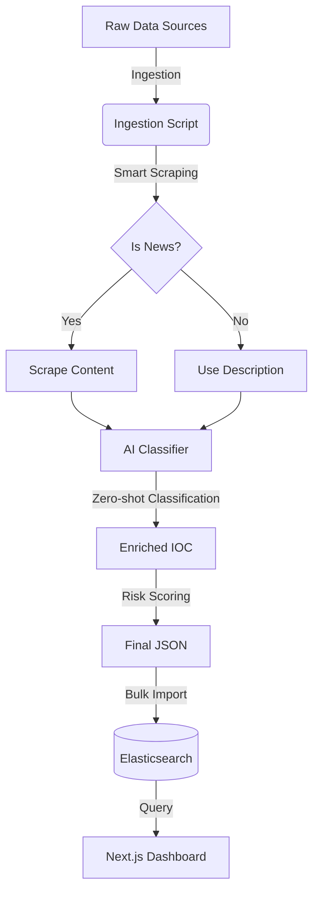

# 🧠 AI Threat Intelligence Pipeline Explained (ฉบับภาษาไทย)

เอกสารนี้อธิบายกระบวนการทำงานของ **AI Service** ตั้งแต่ต้นน้ำ (Ingestion) จนถึงปลายน้ำ (Visualization) อย่างละเอียด เพื่อให้ทีม Developer เข้าใจโครงสร้างและอัลกอริทึมที่เราใช้

---

## 🏗️ ภาพรวมระบบ (Architecture Overview)



---

## 1. 📥 Ingestion (การนำเข้าข้อมูล)

**ไฟล์หลัก:** `ai-service/scripts/ingest.py`

เราไม่ได้แค่ดึงข้อมูลมาเก็บ แต่เราทำ **"Smart Harvesting" & "Incremental Update"**

### 🔍 1.1 กระบวนการทำงาน (Process Flow)
1.  **Scan:** อ่านไฟล์ JSON ทั้งหมดใน `data_lake/`
2.  **Deduplication:** ตรวจสอบกับ Cache (`existing_iocs`) ว่าเคยประมวลผลไปแล้วหรือยัง
    *   *Logic:* ถ้า `description` เดิมยาวพอ (>20 chars) และเคย Scrape แล้ว -> **ข้าม (Skip)** เพื่อความเร็ว
3.  **Batch Processing:** ส่งข้อมูลให้ AI ทีละกลุ่ม (Batch) เพื่อลด Overhead ของ CPU

### 🤖 1.2 Smart Scraping Logic
เราเขียน Logic เพื่อตัดสินใจว่าจะ Scrape หรือไม่ (เพื่อประหยัดเวลา):
```python
SCRAPABLE_SOURCES = ["BleepingComputer", "TheHackerNews", "DarkReading"]

if source in SCRAPABLE_SOURCES and not is_scraped:
    # 🐢 ยอมเสียเวลาโหลดหน้าเว็บ (3-5 วินาที/เว็บ)
    # ใช้ requests + BeautifulSoup4
    content = scraper.scrape(url) 
else:
    # 🐇 ข้ามเลย ใช้ Description เดิม (0.001 วินาที)
    content = original_description
```
* **ผลลัพธ์:** การรันครั้งแรก (First Run) อาจใช้เวลา 2-3 ชม. แต่ครั้งต่อไป (Incremental) จะใช้เวลาแค่ไม่กี่นาที

---

## 2. 🧠 AI Analysis (สมองของระบบ)

**ไฟล์หลัก:** `ai-service/models/classifier.py`

นี่คือหัวใจสำคัญที่เราเสียเวลาประมวลผลนานๆ เพื่อแลกกับ Intelligence

### 🏷️ 2.1 Zero-Shot Classification
เราใช้ **Zero-shot classification (MNLI)** ผ่าน HuggingFace `pipeline("zero-shot-classification")` โดยโมเดลกำหนดจาก `CLASSIFIER_MODEL` ใน `ai-service/config.py` (ค่า default ปัจจุบันเป็นโมเดลที่เบากว่าสำหรับ CPU)
*   **ทำไมต้อง Zero-shot?** เพราะเราไม่ต้องเทรนโมเดลเอง แค่กำหนด "ป้ายกำกับ" (Labels) ให้โมเดลเลือก เช่น `THREAT_CATEGORIES = ["Ransomware", "Phishing", "Data Breach", "Vulnerability", ...]`
*   **การทำงาน:** โมเดลจะอ่านข้อความ (title/description/content) แล้วให้ผลเป็น label + confidence (เช่น "Ransomware = 0.985")

### 📊 2.2 Risk Scoring Formula (สูตรคำนวณความเสี่ยง)

**Source of truth:** `docs/AI-SCORING.md`, `ai-service/models/scorer.py`, `ai-service/config.py`

ระบบนี้ใช้แนวทาง **Weighted Scoring (0-100)** เพื่อควบคุมสเกลและ audit ได้ (ไม่ใช่สูตร normalize แบบเดิม)

ลำดับการคำนวณโดยสรุป:
1. คำนวณ **raw score** รายปัจจัย (มี maxScore)
2. แปลงเป็นคะแนนถ่วงน้ำหนักด้วย `SCORING_WEIGHTS` (weights รวม = 1.0)
3. รวมเป็น `weighted_total` (0-100) แล้ว apply **decay_multiplier**
4. บวก **sector_bonus** (มี guardrails) และผ่าน **policy gates**

#### ปัจจัยคะแนน (Raw Score)

| ปัจจัย | คะแนนเต็ม | สรุป |
|--------|:---:|-----------|
| **Cross-Source Validation** | 30 | 1=5, 2=10, 3=15, 4+=20..30 (diminishing) + diversity bonus |
| **Source Quality** | 40 | trusted=15, news=8, other=5 ต่อแหล่ง (cap 40) |
| **High-Risk Keywords** | 25 | คำละ 5 คะแนน (cap 25) |
| **Entropy (DGA)** | 15 | >4.0=15, >3.5=10, >3.0=5 |
| **Domain Age** | 20 | <30 วัน=20, <90=15, <180=10, <365=5 |
| ~~**Geo Risk**~~ | ~~15~~ | **(ปิดใช้งาน)** เนื่องจากข้อมูลไม่สามารถ audit ได้ |
| **Threat Type Severity (AI)** | 35 | อิง `THREAT_TYPE_SEVERITY` (นับสูงสุด 2 ประเภท + bonus เมื่อพบ >=3) |
| **Threat Actor (AI)** | 30 | อิง `KNOWN_THREAT_ACTORS` (เลือกคะแนนสูงสุดของ actor ที่พบ) |
| **MITRE ATT&CK (AI)** | 20 | อิง `MITRE_TACTICS`/Technique IDs (cap 20) |
| **AI Confidence Bonus** | 10 | อิง `CONFIDENCE_THRESHOLDS` (0/2/5/8) |

#### น้ำหนักที่ใช้จริง (`SCORING_WEIGHTS`)

| Factor key | Weight |
|---|---:|
| `cross_source` | 0.25 |
| `threat_intel_source` | 0.15 |
| `high_risk_keywords` | 0.10 |
| `domain_age` | 0.10 |
| `entropy` | 0.05 |
| `threat_type_severity` | 0.15 |
| `threat_actor` | 0.10 |
| `mitre_techniques` | 0.05 |
| `ai_confidence` | 0.05 |

#### สูตรรวม (Weighted)
```text
weighted_points(factor) = (raw_score / max_score) * weight * 100
weighted_total = Σ weighted_points(ทุก factor ที่เปิดใช้)          // 0..100

score_after_decay = round(weighted_total) * decay_multiplier
operational_risk  = min(score_after_decay + sector_bonus, 100)      // มี guardrails + policy gates
```

#### Modifiers / Governance ที่สำคัญ
- **Decay Factor:** ลดคะแนนตามอายุ IOC (`ioc_age_days`) (<=7=1.00, 8-30=0.90, 31-90=0.75, 91-180=0.60, >180=0.50)
- **Sector Bonus:** บวกคะแนนตามเซกเตอร์เป้าหมาย (มี guardrail: ถ้า confidence < 0.45 cap bonus <= 5 และถ้าเป็น news-only cap bonus <= 3)
- **Policy Gates:** ลด false escalation (บันทึกใน `breakdown.policy_gate`) เช่น
  - **Critical gate:** ถ้าคะแนนหลัง decay + sector bonus >= 80 แต่ `trusted` < 2 → cap เป็น 74 (High)
  - **News-only gate:** ถ้าเป็นข่าวล้วน (news-only) และคะแนน >= 50 → cap เป็น 49 (Medium)

#### ระดับความรุนแรง (Severity)
- **Critical:** ≥ 75 คะแนน 🔴
- **High:** 50-74 คะแนน 🟠
- **Medium:** 25-49 คะแนน 🟡
- **Low:** 1-24 คะแนน 🟢
- **Clean:** 0 คะแนน ⚪


---

## 3. 🔮 Trend Prediction (การพยากรณ์อนาคต)

**ไฟล์หลัก:** `ai-service/models/trend_predictor.py`

เราใช้ Library **`Prophet`** (ของ Facebook) เพื่อทำ Time-series Forecasting

*   **Model Config:**
    *   `changepoint_prior_scale=0.5`: ให้โมเดลไวต่อการเปลี่ยนแปลงฉับพลัน (เช่น อยู่ๆ Ransomware พุ่งสูง)
    *   `daily_seasonality=True`: วิเคราะห์ Pattern รายวัน
    *   `interval_width=0.95`: ความเชื่อมั่น 95%
*   **Fallback Mechanism:** หากติดตั้ง Prophet ไม่สำเร็จ ระบบจะถอยไปใช้ **Linear Regression** (สมการเส้นตรง) อัตโนมัติ เพื่อให้ระบบไม่ล่ม
*   **Output:** ทำนายแนวโน้ม 7 วันข้างหน้า (เช่น "Ransomware จะสูงขึ้น 20% ในวันจันทร์") และหา % การเปลี่ยนแปลง (Growth Rate)

---

## 4. 🗄️ Storage & Search (Elasticsearch)

ทำไมไม่ใช้ MySQL/PostgreSQL?
*   **Full-Text Search:** เราต้องการค้นหาคำว่า "LockBit" ในเนื้อหาข่าวล้านๆ คำ ภายใน 0.1 วินาที
*   **Aggregation:** การวาดกราฟ (เช่น "นับจำนวน Threat แยกตามประเทศ") Elastic ทำได้เร็วกว่า SQL มาก

---

## 5. 💻 Visualization (Next.js Dashboard)

**ไฟล์หลัก:** `dashboard/src/app/page.tsx`

หน้าเว็บไม่ได้คำนวณอะไรเอง มันแค่:
1.  ยิง API ไปหา Elasticsearch (`search_threats`, `aggregate_counts`)
2.  เอา JSON ที่ได้มาวาดกราฟสวยๆ

---

## ✅ สรุปประโยชน์ของระบบนี้ (Business Value)

1.  **แปลงข้อมูลขยะเป็นทอง:** จาก Log ดิบๆ ที่อ่านไม่รู้เรื่อง -> กลายเป็น Insight ว่า "ใครทำ, ทำไม, ที่ไหน"
2.  **ลดเวลาคน (Man-hour):** ไม่ต้องจ้างคนมานั่งอ่านข่าว Cyber Security วันละ 500 ข่าว
3.  **เตือนภัยล่วงหน้า:** เห็นแนวโน้มก่อนเกิดเหตุจริง

---
*เอกสารฉบับนี้จัดทำขึ้นเพื่อให้ทีม Dev เข้าใจภาพรวม หากต้องการแก้ Code ส่วนไหน ให้ดูที่ชื่อไฟล์ที่กำกับไว้ในแต่ละหัวข้อ*
